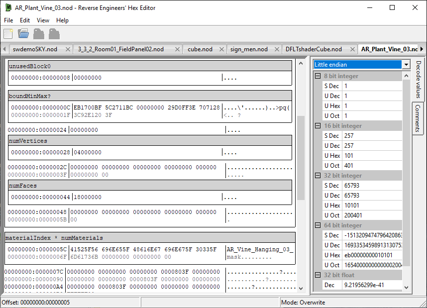

# Reverse Engineer's Hex Editor

## What is this?

As the name implies, this is a hex editor. It aims to be a good general-purpose hex editor and to have a wide selection of features for analysing and annotating binary file formats.

It is still in early development and should be considered in beta state at the moment. Current features include:

* Large* file support
* Decoding of integer/floating point value types
* Disassembly of machine code
* Highlighting and annotation of ranges of bytes

\* I've gone up to 1TiB in cursory testing, but it should be able to go a lot higher... just in case you want to start editing big disk images.

## How can I run it?

If you're running Linux, just checkout the source and run `make`. You will need Jansson, wxWidgets and LLVM installed, along with their development packages.

If you're running Windows or OS X, the quickest way is to go to the commit history, follow a link to the relevant Buildkite job and download the binary from the artifacts tab.

## Feedback

If you find any bugs or have suggestions for improvements or new features, please open an issue on Github.
