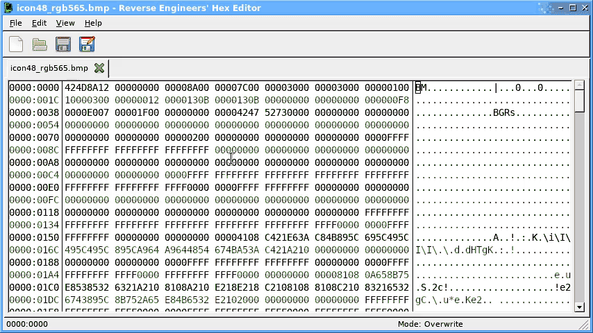
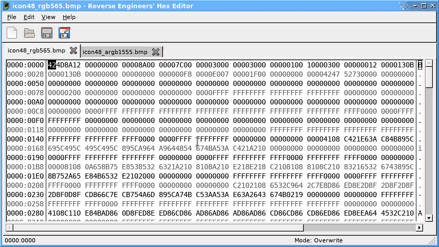

#  Reverse Engineers' Hex Editor

A cross-platform (Windows, Linux, Mac, BSD) hex editor for reverse engineering, and everything else.

An online copy of the manual can be accessed here: [solemnwarning.net/rehex/manual/](https://solemnwarning.net/rehex/manual/).

## Features

* Large (1TB+) file support
* Decoding of integer/floating point value types
* Inline disassembly of machine code
* Highlighting and annotation of ranges of bytes
* Side by side comparision of whole files or selections
* Lua scripting support ([API reference](http://www.solemnwarning.net/rehex/luadoc/))
* Virtual address mapping support
* Support for common text encodings (ASCII, Unicode, ISO-8859-X)
* Import and export of Intel HEX files.
* Bitmap data visualisation.
* Binary Templates for automatically annotating data (similar to 010 Editor).

## Installation

The [Releases](https://github.com/solemnwarning/rehex/releases) page has standalone packages for Windows and Mac, as well as installable packages for popular Linux distributions, or you can install them from a distribution package repository as described below.

The same packages are also produced for Git commits (look for the tick), if you want to try the development/unreleased versions.

### Debian

First, you will need to add my APT signing key to your system:

    sudo wget -O /etc/apt/trusted.gpg.d/solemnwarning-archive-keyring.gpg \
        https://repos.solemnwarning.net/debian/solemnwarning-archive-keyring.gpg

Add the following lines to your `/etc/apt/sources.list` file:

    deb http://repos.solemnwarning.net/debian/ CODENAME main
    deb-src http://repos.solemnwarning.net/debian/ CODENAME main

**NOTE:** Replace `CODENAME` with the version you're running (e.g. `bullseye` or `buster`).

Finally, you can install the package:

    $ sudo apt-get update
    $ sudo apt-get install rehex

### Ubuntu

First, you will need to add my APT signing key to your system:

    sudo wget -O /etc/apt/trusted.gpg.d/solemnwarning-archive-keyring.gpg \
        https://repos.solemnwarning.net/ubuntu/solemnwarning-archive-keyring.gpg

Add the following lines to your `/etc/apt/sources.list` file:

If running Ubuntu 20.04 (Focal Fossa) or later:

    deb  [arch=amd64] http://repos.solemnwarning.net/ubuntu/ CODENAME main
    deb-src  [arch=amd64] http://repos.solemnwarning.net/ubuntu/ CODENAME main

**NOTE:** Replace `CODENAME` with the version you're running (e.g. `focal` for 20.04 or `hirsute` for 21.04).

If running Ubuntu 18.04 (Bionic Beaver):

    deb http://repos.solemnwarning.net/ubuntu/ bionic main
    deb-src http://repos.solemnwarning.net/ubuntu/ bionic main

Finally, you can install the package:

    $ sudo apt-get update
    $ sudo apt-get install rehex

**NOTE:** Ubuntu users must have the "universe" package repository enabled to install some of the dependencies.

### Fedora

    $ sudo dnf copr enable solemnwarning/rehex
    $ sudo dnf install rehex

### CentOS

    $ sudo dnf install epel-release
    $ sudo dnf copr enable solemnwarning/rehex
    $ sudo dnf install rehex

### openSUSE
    $ sudo zypper ar obs://editors editors
    $ sudo zypper ref
    $ sudo zypper in rehex

### FreeBSD
    $ pkg install rehex

## Building

If you want to compile on Linux, just check out the source and run `make`. You will need Jansson, wxWidgets, GTK+, Capstone, Lua, libunistring and Template Toolkit installed, along with their development packages (`sudo apt install build-essential git libcapstone-dev libgtk-3-dev libjansson-dev libwxgtk3.0-gtk3-dev liblua5.3-dev libtemplate-perl libunistring-dev lua5.3 zip lua-busted` on Ubuntu).

The resulting build can be installed using `make install`, which accepts all the standard environment variables.

For Windows or Mac build instructions, see the relevant README: [README.Windows.md](README.Windows.md) [README.OSX.md](README.OSX.md)

## Feedback

If you find any bugs or have suggestions for improvements or new features, please open an issue on Github, or join the `#rehex` IRC channel on `irc.libera.chat`.
